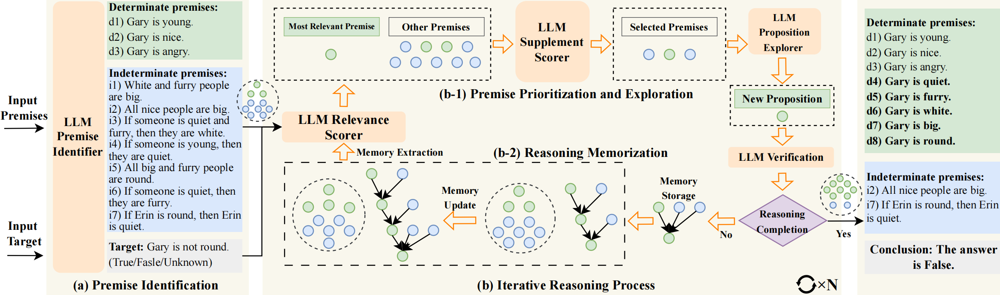

# DetermLR

This repository is the official implementation of our paper [**DetermLR: Augmenting LLM-based Logical Reasoning from Indeterminacy to Determinacy**](https://arxiv.org/abs/2310.18659), which has been accepted at ACL 2024 main.



## Installation

`pip install -r requirements.txt`

Note: We recommend using guidance-0.0.64 for adopting GPT-3.5-turbo or GPT-4.

## Setup OpenAI API

Please set your openai api key in `os.environ["OPENAI_API_KEY"]="YOUR_API_KEY"`.

Make sure that your device is able to connect to [OpenAI API](https://platform.openai.com/docs/api-reference).

## Implementation
Quick start for implementing DetermLR to solve four logical reasoning tasks.

### LogiQA
```python
python logiqa-determlr.py
```

### ProofWriter
```python
python proofwriter-determlr.py
```

### FOLIO
```python
python folio-determlr.py
```

### LogicalDeduction
```python
python logicaldeduction-determlr.py
```

In addition to determlr, we also include baseline methods (cot, tot, cr) for four logical reasoning tasks.
Directly run the script `python {TASK}-{METHOD}.py` to implement them.

### Key Hyper-parameter settings:
For the implementation of our DetermLR, several important arguments are introduced as follows:


- `propnum`: number of generated determinate premises (choices=`{2,3,4,5}`)

- `reasoningnum` : final question number of vote choice {default=4,8,16}

- `condition_divide`: whether to divide premise into determinate and indeterminate {default=True}

- `con_select` : whether to include premise prioritization {default=True}

- `memory`: whether to infer premise generating history or not {default=True}

- `useful_judgement`: whether to include useful_judgement validation {default=True}

- `global_validation`: whether to include global_validation, not required on ProofWriter.


## Acknowledgement

Partial credit to previous reprostories: [Guidance](https://github.com/microsoft/guidance) and [Cumulative Reasoning](https://github.com/iiis-ai/cumulative-reasoning).

## Citations
Please cite the paper and star this repo if you use DetermLR and find it interesting/useful, thanks!

Feel free to contact xuwk266@gmail.com for any questions.
```bibtex
@article{sun2023DetermLR,
      title={DetermLR: Augmenting LLM-based Logical Reasoning from Indeterminacy to Determinacy}, 
      author={Sun, Hongda and Xu, Weikai and Liu, Wei and Luan, Jian and Wang, Bin and Shang, Shuo and Wen, Ji-Rong and Yan, Rui},
      journal={arXiv preprint arXiv:2310.18659},
      year={2023}
}
```
